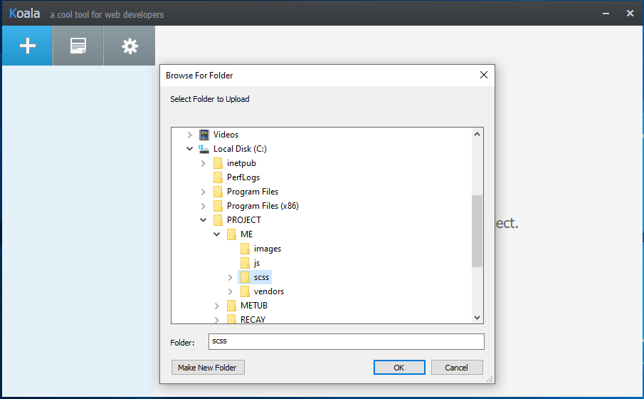
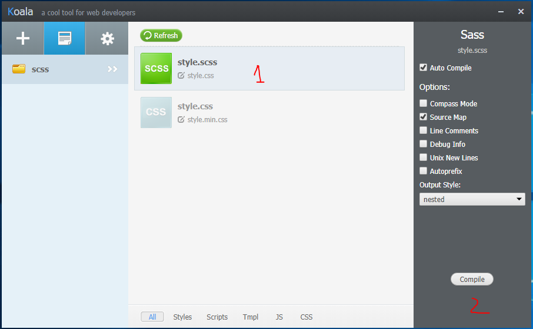

# HTML CSS APP 

Hướng dẫn chuyển đổi scss sang css:
1. Cài đặt Koala

Download <a target='_blank' href="http://koala-app.com/">tại đây</a> và cài đặt.

2. Mở Koala, click vào dấu + và tìm đến Folder source » scss

Khi mở Folder scss Click vào "style.scss" (step 1). Sau đó click vào button "Complie" (step 2).

Ctrl + S sẽ auto biên dịch scss -> css.

3. Khi css hoàn chỉnh nhận được: 'style.css'.
